# VBA Homework: The VBA of Wall Street

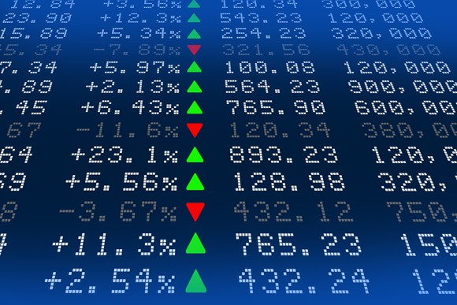

## Background/Problem Statement:

To create a Visual Basic Application (VBA) script that will loop through each of the following 2014, 2015, and 2016 years. This will include the following below:

* 1. The stock symbol or ticker name

* 2. The yearly change found from the opening price at the beginning of the year  the closing price 

* 3. The percent change using the opening price at the beginning of a given year and the closing price of that same given year

* 4. The total stock volume 

* 5. Conditional formatting that distinguishes between positive change (green) and negative change (red)

## Development of the code, thinking through the Background/Problem Statement, and putting in paper.

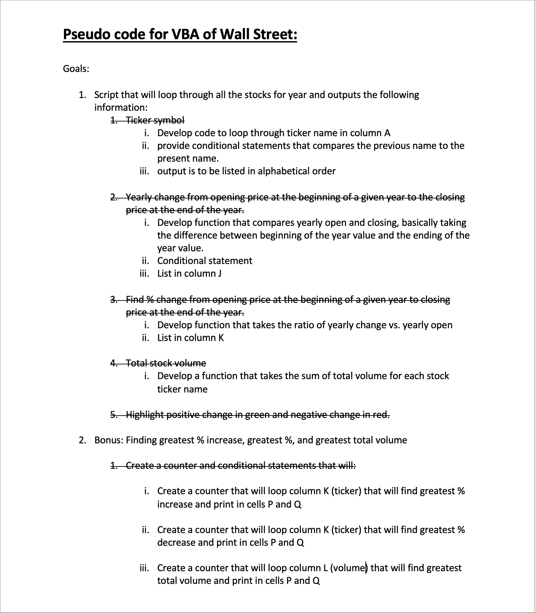

## Testing the VBA script using the alphabetical testing data.

* The file `alphabetical_testing.xlsx`  was used developing the code. This data set is smaller and will allow you to test faster. 

### Testing Results

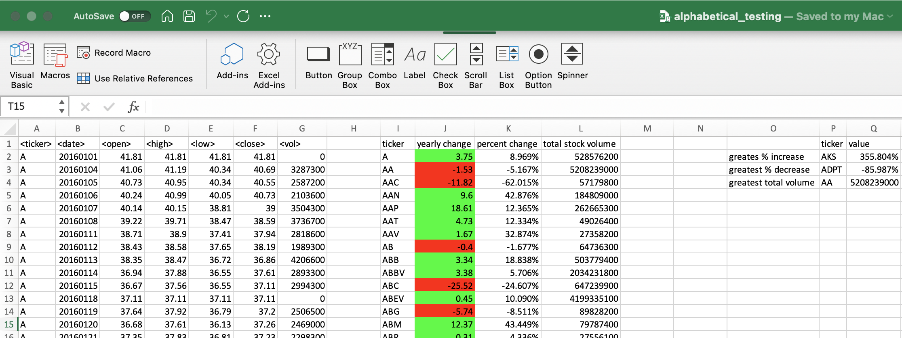 - A results
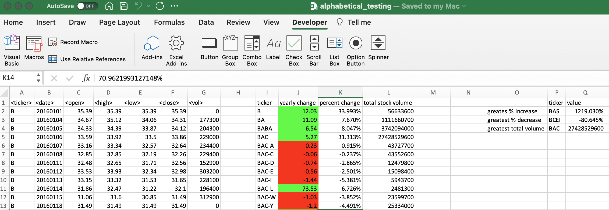 - B results
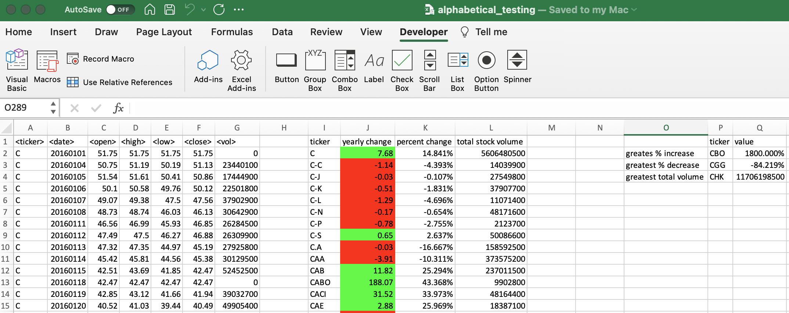 - C results
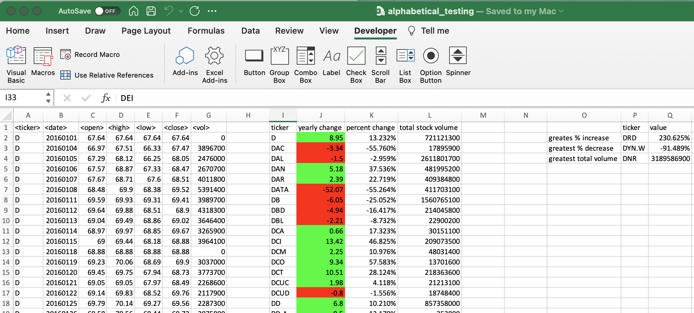 - D results
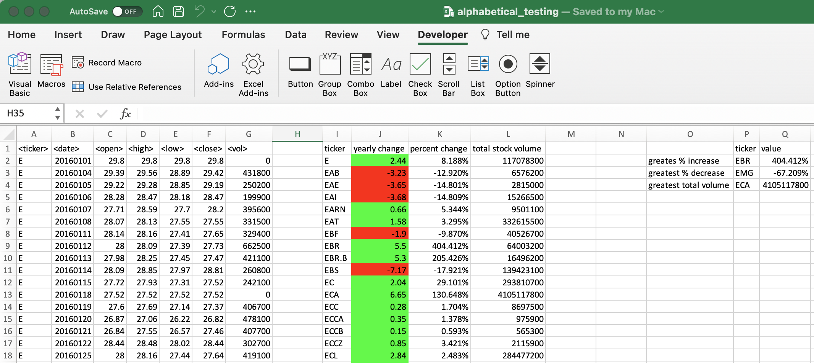 - E results
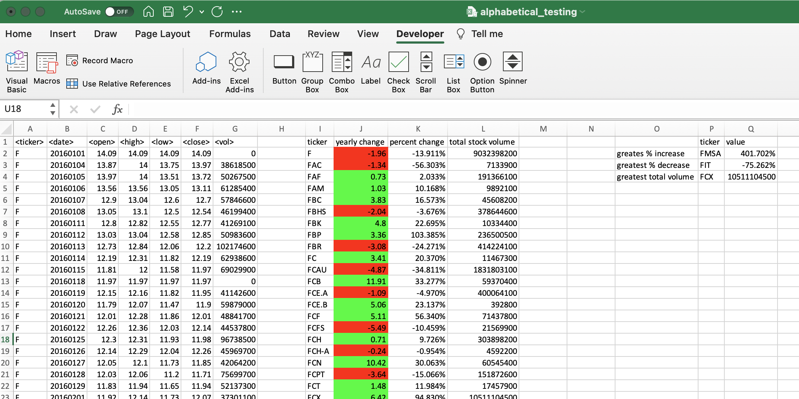 - F results
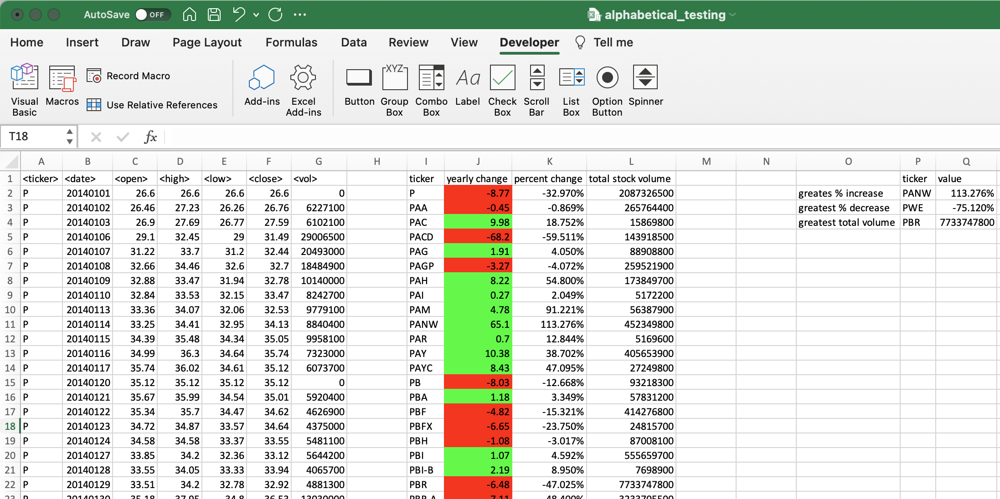 - P results

## Delieverables/Results

* The file `Multiple_year-stock_data.xlsx` was used to provide deliverables.

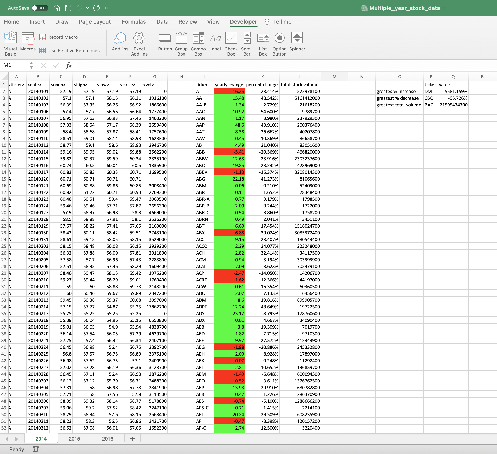 - 2014 results
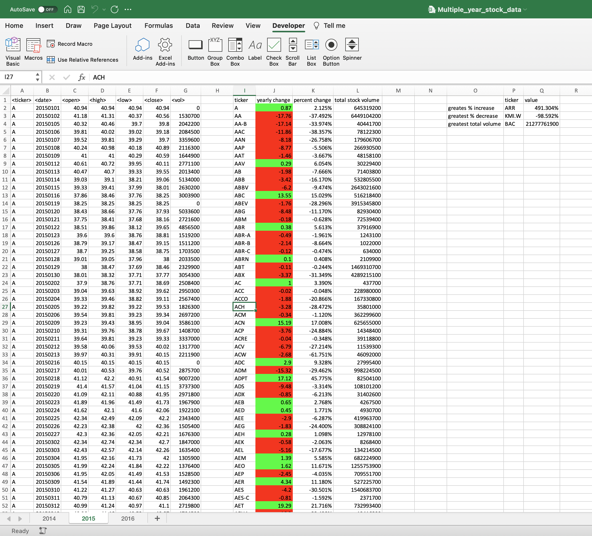 - 2015 results
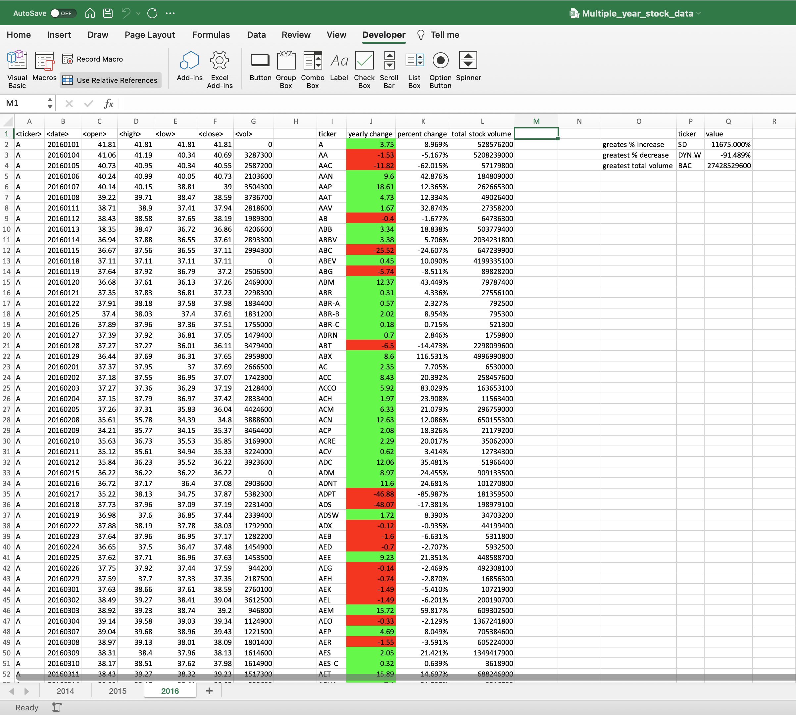 - 2016 results

